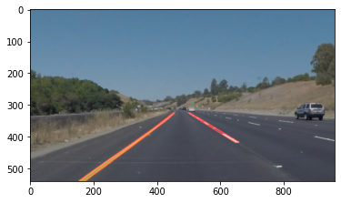
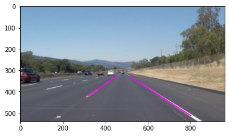
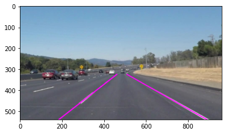

# project1_lane_lines
Project 1 for Udacity Self-Driving Car Engineer Nanodegree. Uses OpenCV to find lane lines.

This repository contains a Jupyter notebook which works through the process of building a lane finding pipeline, then contructs a class object which performs this functionality, and deploys it on image and video data. The outputs of this pipeline can be found stored in the image and video output folders in this repository. The lane finding pipeline class object loads with effective parameters, but they can be refined by the user for specific tasks. Further, the user has the option to filter and merge the lines based on slope and intercept criteria, as well as extrapolate them from the bottom of the image to the lane horizon so that they cover the whole lane boundary. For a complete description of the pipeline and the parameters, please see the docstring in the Lane_Finder class found in the P1.ipynb notebook.

### Sample Images:

Lane lines without filtering, merging, or extrapolating:

Lane lines with filtering/merging, but no extrapolation:

Lane lines with filtering, merging, and extrapolation:

### Contents:

- P1.ipynb - Jupyter notebook containing all code, as well as the final Lane_Finder pipeline class.
- examples/ - folder containing example outputs provided by Udacity to aid in project development.
- test_images/ - folder containing raw images to test lane finding pipeline on.
- test_images_output/ - folder containing test images that have been treated by the pipeline during development.
- test_videos/ - folder containing raw videos to deploy lane finding pipeline on.
- test_videos_output/ - folder containing test videos that have been treated by the pipeline.
- writeup.md - Markdown file containing the official project write-up for submission.