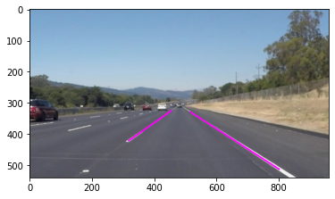

# **Finding Lane Lines on the Road** 

## Project Writeup

### Nathaniel Cibik - March 2021

---

**Finding Lane Lines on the Road**

The goals / steps of this project are the following:
* Make a pipeline that finds lane lines on the road
* Reflect on your work in a written report

---

### Reflection

### 1. Describe your pipeline. As part of the description, explain how you modified the draw_lines() function.

My lane-finding pipeline consisted of 5 steps to generate lines, and 3 optional additional steps to filter, merge, and extrapolate the lines returned from the first part of the pipeline. The pipeline is executed through the use of a class object called Lane_Finder. The instance variables of the class serve as parameters for the pipeline execution process, which take effective default values, but can be adjusted by the user. The steps of the pipeline are as follows:

1. Convert the image to grayscale
2. Grayscale image blurred with a 5x5 Gaussian kernel
3. Blurred grayscale image passed through the OpenCV Canny edge detector with a lower threshold of 50 and and upper threshold of 150 by default
4. Canny edges are masked to a Region of Interest using vertices passed to cv2.fillPoly()
5. Masked edges are sent through cv2.HoughLinesP to generate lines

Optional steps:
6. Lines are filtered based on a minimum slope value to ignore horizontal lines
7. Filtered lines are then merged based on slope and intercept similarity
8. Lines are extrapolated from image bottom to the top of the region of interest

To keep the functionality of each function specific, I did not add anything to the draw_lines() method of the Lane_Finder class, and this method only takes an image and lines as input and returns a new image with the lines drawn on it. The line color and thickness depend on whether filter_and_merge class instance variable is set to True. If lines are filtered and merged, the lines are thicker and a brighter magenta color to be more easily seen, and the weighted_img() method is not used. If the lines are not filtered and merged, then the lines are thinner, red in color, and the weighted_img() method is used to make them translucent. The merging/filtering and extrapolation can be applied at the user's preference.

For more detailed information on the pipeline and the parameters, as well as their default values, please see the docstring for the Lane_Finder class found in the P1.ipynb notebook in this repository.

Lane lines without filtering, merging, or extrapolating:

Lane lines with filtering/merging, but no extrapolation:

Lane lines with filtering, merging, and extrapolation:

### 2. Identify potential shortcomings with your current pipeline

One definite shortcoming of this pipeline is that it is not designed to take curved lanes, or intersections into account, and is therefore only really suitable for highways and straight roads.

Other shortcomings present themselves when applying the pipeline to the challenge video. When the car passes over an overpass, there is a color shift in the pavement which causes it to lose track of the yellow line due to lack of contrast/gradient. Also, the curvature of the lanes causes discontinuities in line detection. Noise on the shoulder was able to be handled by modifying pipeline parameters, however, by increasing size of Gaussian kernel.

Additionally, while the pipeline was able to operate in better than real time on the first two videos, the challenge video caused the pipeline to take longer than the actual time of the video.

### 3. Suggest possible improvements to your pipeline

One definite improvement would be to add functionality for curved lines, as well as finding the center of the lane from the lane lines that it finds, and estimating the car's position relative to lane center. This is going to be the objective of the next project, so I look forward to learning to do this.

Another improvement would be to find a fix for the errors caused by pavement color variance. This could possibly be done by increasing the contrast of the image after the blurring is done, since this may help the yellow stand out on brownish pavement, without increasing the effects of noise on the pipeline.
